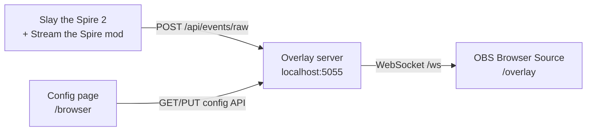

# Introduction

**Stream the Spire** is a local streaming overlay for **Slay the Spire 2**. While you play, a small in-game mod sends reward events to a web server on your PC. OBS (or any app with a transparent browser source) shows animated toasts - cards, relics, and potions - where you place them on screen.

Everything runs on your machine. There is no cloud account, no Twitch integration, and no data leaves your PC unless you choose to stream it.

**Setup video:** [Watch the full walkthrough on YouTube](setup-video.md).

## The three pieces

| Piece | What it does |
|-------|----------------|
| **Game mod** | Watches your run and POSTs events (e.g. card picked, relic taken) to the overlay server |
| **Overlay server** | Receives events, applies your config (ignore lists, timing, slots), and pushes updates over WebSocket |
| **Overlay page in OBS** | Transparent browser source at `/overlay` that shows and animates each toast |

Open **`/config`** in a normal browser tab to arrange slot positions, pick image vs text mode, set sounds, and save - the live overlay picks up changes without restarting OBS.

Default server URL: **http://127.0.0.1:5055**

- Overlay (OBS): `/overlay`
- Config: `/config`
- Item ID lookup: `/item-ids`

## What it can do

### Key terms

| Term | Plain meaning |
|------|----------------|
| **Toast** | The popup on your stream when you gain a card, relic, or potion (or when other events fire). It animates in, holds, then animates out. |
| **Parallel** | Multiple toasts **at the same time** (in the band or slot group you configured). |
| **Sequential** | Toasts **one after another**: the next waits until the current one finishes. |

Full definitions (slots, bands, queues, both timing levels): [Configuration and testing: Terminology](configuration-and-testing.md#terminology).

### Event types

The mod and server understand these event types. You can turn each one on or off on the config page (Cards / Relics / Potions tabs → event rules).

| Event | When it fires | Notes |
|-------|----------------|-------|
| `card_gained` | Card added to your deck | |
| `card_removed` | Card removed from your deck | Shows a red “removed” mark on the art |
| `card_transformed` | One card replaced by another | Shows previous and new card |
| `card_upgraded` | Card upgraded | |
| `card_enchanted` | Card enchanted | Image mode: layered enchant art + description overlay when catalog and mod data are available |
| `relic_gained` | Relic obtained | |
| `potion_gained` | Potion picked up | |
| `potion_used` | Potion used | Shows a “removed” style mark |

### Display modes

- **Image mode** - Full art for cards, relics, and potions when a local [image catalog](https://github.com/quality1441/sts2-image-versions) is configured. Cards can use layered preview art; enchanted cards add wedge, icon, and description overlays. The mod may also cache some in-game visuals.
- **Text mode** - Compact name / description toasts for all item types. Works without a catalog.

Switch modes on the config page (tabs above the layout preview). One setting applies to cards, relics, and potions.

### Layout and animation bands

- Up to **12 slots** total, up to **4 per type** (card, relic, potion).
- Drag slot ghosts on the layout preview to match your stream layout; set preview canvas size to your OBS Browser Source resolution (e.g. 1920×1080) and **save**.
- Per-type scale controls how large toasts appear on stream.
- **Animation bands** (below the preview) group slots and control **when** toasts play (sequential or parallel **within** each band and **across** bands). See [Configuration and testing: Animation bands](configuration-and-testing.md#animation-bands).

### Sounds and animation

Global **enter** and **exit** animations apply to all events unless a band sets its own enter/exit animation. Global **enter** and **exit** sounds are chosen under **Global settings → Sound**.

**Sound mode** (on `/config`):

| Mode | When to use |
|------|-------------|
| **First event and last event end** (default) | Reward screens and parallel picks: one enter at the start of a burst, one exit when the last item from that burst is assigned |
| **On (every toast)** | Separate pickups each get enter/exit; rapid events while a toast is still showing share one enter and one exit (sounds are queued so they never overlap) |
| **Off** | Silent toasts |

Details and examples: [Configuration and testing: Sounds](configuration-and-testing.md#sounds-animations-and-event-rules). You can upload custom sound files from the config page.

### Playback after combat rewards

When several rewards arrive at once (typical after combat), the server queues by item type (card / relic / potion) and assigns toasts using your **animation bands**:

- **Band playback sequential**: Band 1 finishes (slots idle, queues empty for those slots) before Band 2 starts. Replaces the old “relic → card → potion” type order when each type has its own band.
- **Band playback parallel**: All active bands can show toasts at the same time.
- **Slot playback sequential**: One visible toast per item type at a time in band order, with overflow to a second same-type slot when the first is still up (the overlay slides it forward when the front slot clears). **Parallel**: every free slot in the band can fill at once.

Configure bands on **`/config`** under the layout preview. **Export setup…** in the bottom action bar saves slots + bands to a JSON file for another PC or backup.

### Ignore lists

- **Global ignore IDs** - Comma-separated item IDs skipped for every event. `POTION_SHAPED_ROCK` is ignored by default.
- **Per-type and per-event toggles** - Turn off all cards, or only `card_gained`, etc.
- Use **`/item-ids`** to look up IDs for your ignore list (matches what the mod sends as `itemId`).

## What it cannot do

- **No Twitch, YouTube, or cloud hooks** - It only talks to `localhost` (or whatever you set in `STS2_OVERLAY_URL`). Alerts, chat bots, and channel point redemptions are out of scope.
- **No bundled game art** - Full-image mode needs a separate local catalog ([sts2-image-versions](https://github.com/quality1441/sts2-image-versions)) or your own exports. Text mode works without it.
- **Windows release only** - Stream the Spire is distributed as a Windows zip (`OverlayServer.exe` + pre-built mod). There is no public source repo for end users.
- **Not an official Mega Crit product** - See [Disclaimer](#disclaimer) below.

## How data flows



In plain terms:

1. You pick up a relic in-game → mod POSTs a `relic_gained` event to the server.
2. Server checks ignore lists, slot availability, and **animation bands** → queues a toast.
3. Server sends a **show** message over WebSocket → overlay page animates the toast in the matching slot.
4. When you change settings on `/config` and save, the server stores config and broadcasts updates to connected **overlay** clients over WebSocket.

## Requirements

Use this checklist before your first stream:

- [ ] **Slay the Spire 2** installed (Windows)
- [ ] **[.NET 10 ASP.NET Core Runtime](https://dotnet.microsoft.com/download/dotnet/10.0)** installed (Windows x64)
- [ ] **Stream the Spire** release zip extracted and **`run-server.cmd`** running → http://127.0.0.1:5055
- [ ] **Mod copied** to `{Slay the Spire 2}\mods\Sts2StreamOverlay\` - see [Mod installation](mod-installation.md) or [Getting started](getting-started.md)
- [ ] **OBS** (or similar) with a **Browser Source** pointing at `/overlay`, transparent background, size matching your canvas
- [ ] **Config saved** - at least one slot per item type you want on stream; layout preview canvas matches OBS resolution
- [ ] **Optional:** [sts2-image-versions](https://github.com/quality1441/sts2-image-versions) downloaded and paths set on the config page for full-image mode

**Useful environment variables** (optional):

| Variable | Default | Purpose |
|----------|---------|---------|
| `STS2_OVERLAY_URL` | `http://127.0.0.1:5055` | Server URL for the game mod |
| `STS2_GAME_ROOT` | - | Your STS2 install folder (when copying the mod to a non-default path) |

Catalog paths belong on the **config page** (saved to `data/config.json`). The server reloads them when you **Save**; you do not need to restart for catalog changes. See [Image catalog](image-catalog.md) for optional `STS2_IMAGE_VERSIONS_ROOT` / `STS2_GAME_VERSION` fallbacks and maintainer scripts.

## Optional image catalog

Full-image mode reads WebP files from a local folder layout:

```text
{STS2_IMAGE_VERSIONS_ROOT}\{STS2_GAME_VERSION}\
  cards\
  potions\
  relics\
```

Pre-built catalogs are published in **[sts2-image-versions](https://github.com/quality1441/sts2-image-versions)**. Set **Catalog root** and **Game version folder** on the config page and **Save config**.

Without a catalog, use **text mode** or rely on limited art the mod exports at runtime.

## Disclaimer

**Slay the Spire 2** and its assets are property of **Mega Crit**. Stream the Spire is an **unofficial** community tool for personal streaming. Use and redistribute game-derived art only in line with Mega Crit’s terms and the [sts2-image-versions](https://github.com/quality1441/sts2-image-versions) guidance.

## Next steps

- [Getting started](getting-started.md)
- [Install the mod](mod-installation.md)
- [Documentation index](README.md)
- [Troubleshooting](troubleshooting.md)
